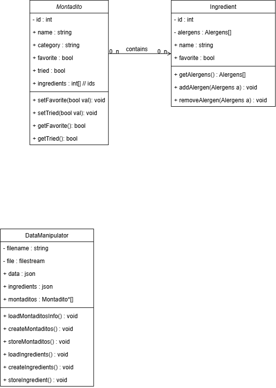
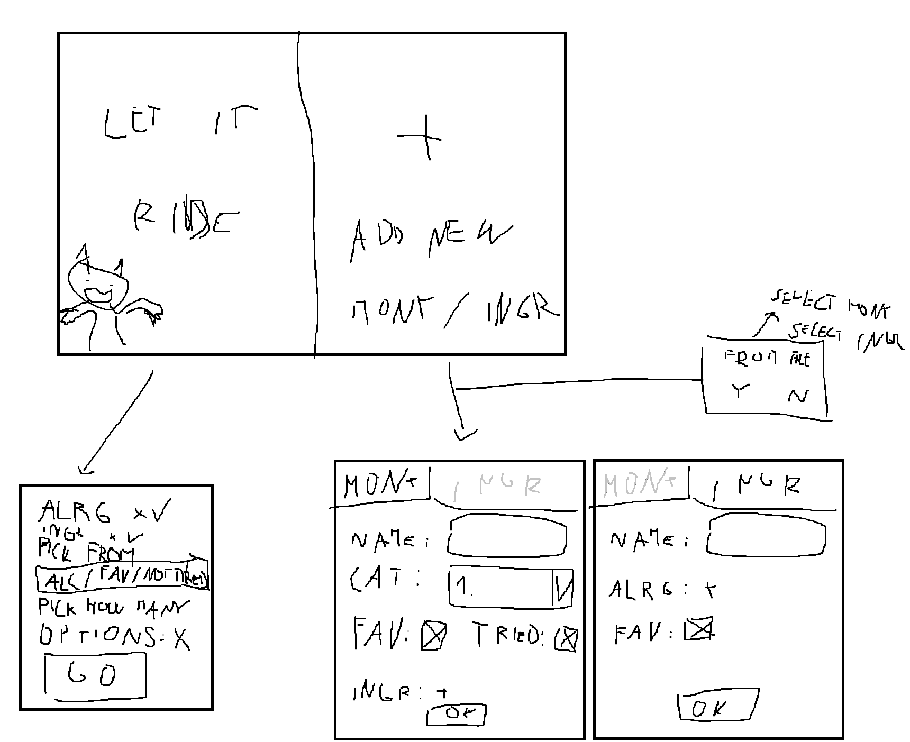

# Montadito picker
This program aims to solve my problem of being on Erasmus in Spain and not knowing which montaditos to pick because of my indecisiveness. While also wanting to try out as many of them as possible.

~~First version will be glorified random number generator. But I feel like this has much bigger potential.~~

I decided to remake it in cpp.

## First idea of classes needs more thinking out

## Very high quality Screen flow diagram

